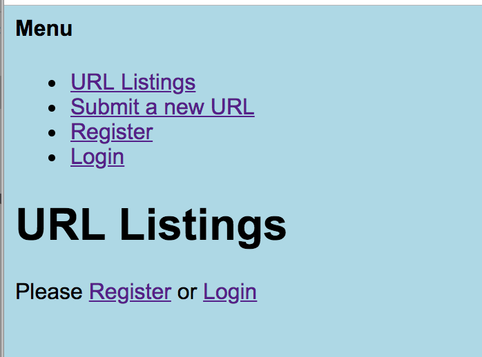
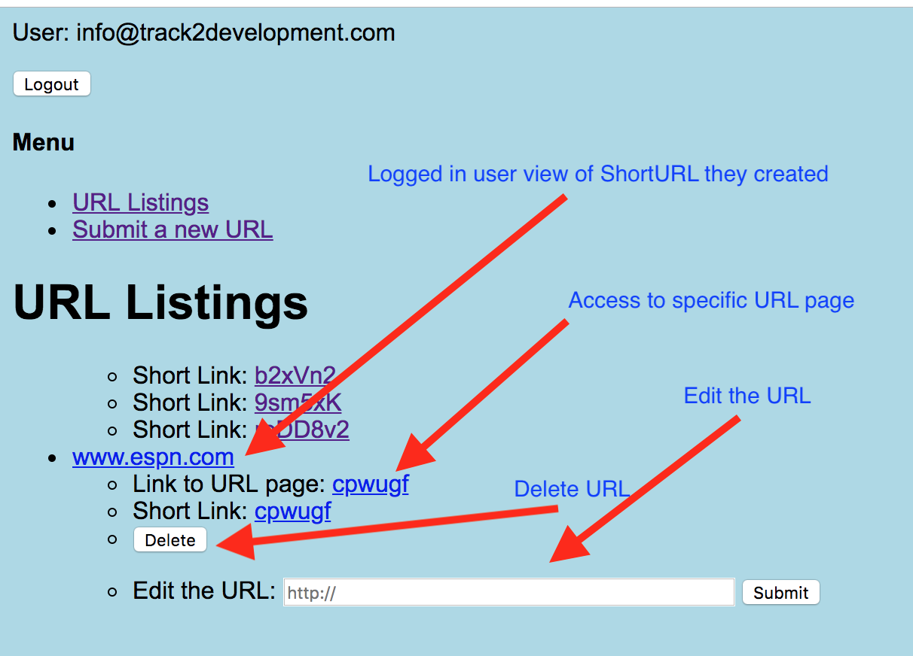

# taproject
This is the final repo for my tinyapp project.  There are very few commits as there were server issues with express introduced as well as confusion around code improvements and git branches.

Dependencies are as follows:
- express
- ejs
- cookie-session
- body-parser
- bcrypt

## functionality
The tinyapp is fairly straightforward.  A new user is given a simple homepage (/urls) with prompts for login and registration. If they attempt to see a URL Listing or Submit a new URL, they are again given prompts to register or login.  I did not create specific error messages for those events.

Screenshot for user who is not logged in:

The main functionality for a logged in user is that they can edit and delete their own URLs:

