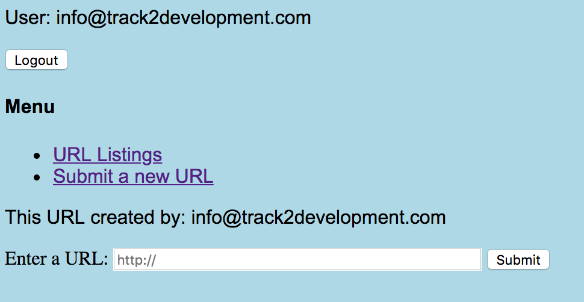

# taproject
This is the final repo for my tinyapp project.  There are very few commits as there were server issues with express introduced as well as confusion around code improvements and git branches.

Dependencies are as follows:
- express
- ejs
- cookie-session
- body-parser
- bcrypt

## functionality
The tinyapp is fairly straightforward.  A new user is given a simple homepage (/urls) with prompts for login and registration. If they attempt to see a URL Listing or Submit a new URL, they are again given prompts to register or login.  I did not create specific error messages for those events.

Screenshot for user who is not logged in:

Screenshot for prompt to register:

After a user is logged in, if they select Submit a URL they will be sent to a screen (/urls/new) that provides a form to enter a url:

The user can then continue the process of adding more URLs to get shorteners or use the edit and delete buttons to make changes to existing URLs.  They may only edit or delete their own URLs.

All logged in users can see examples of shortened URLs (3 created by default by the app) which link to the long URLs (ie. external websites).  They may not edit or delete them.

